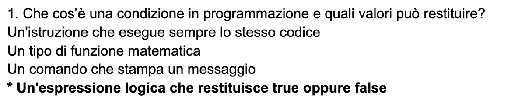

Modalità di utilizzo:
- inserisci il quiz.docx in formato panquiz (domanda con a capo le 4 risposte, con risposta giusta con * iniziale)
- avvia il programma: genera un file booklet.xlsx
- a quel punto puoi esportare i file in csv e importare domande su booklet

Esempio domanda:

Version: Python 3.13
